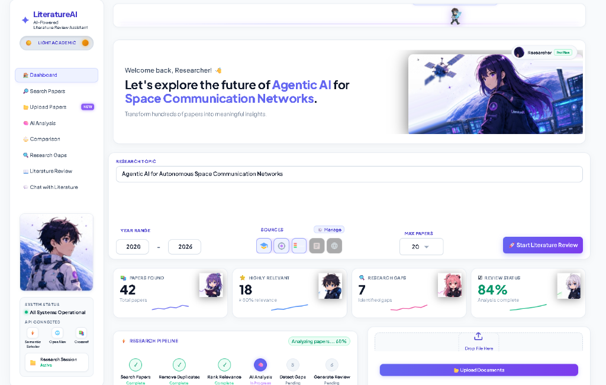
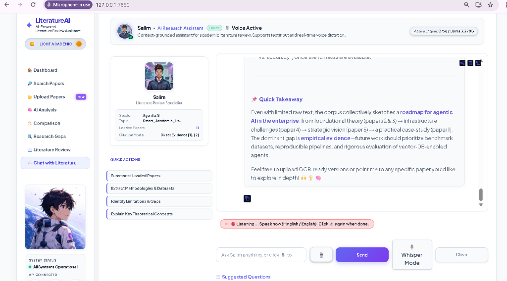
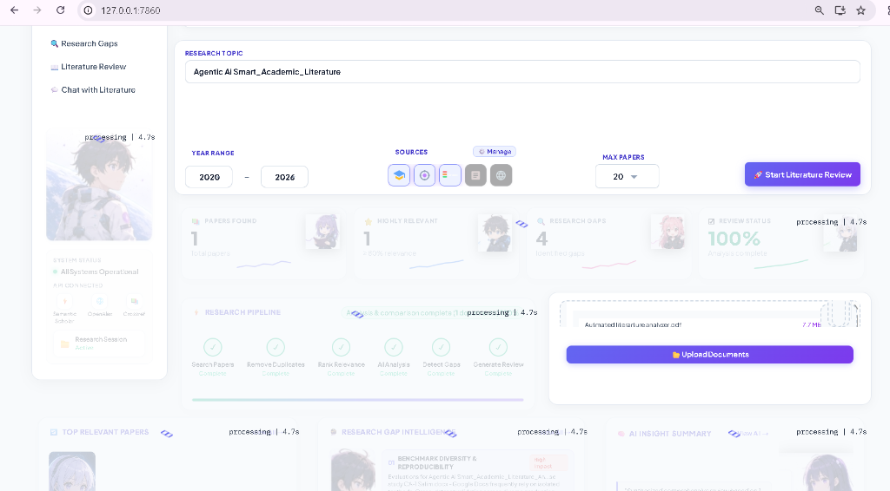
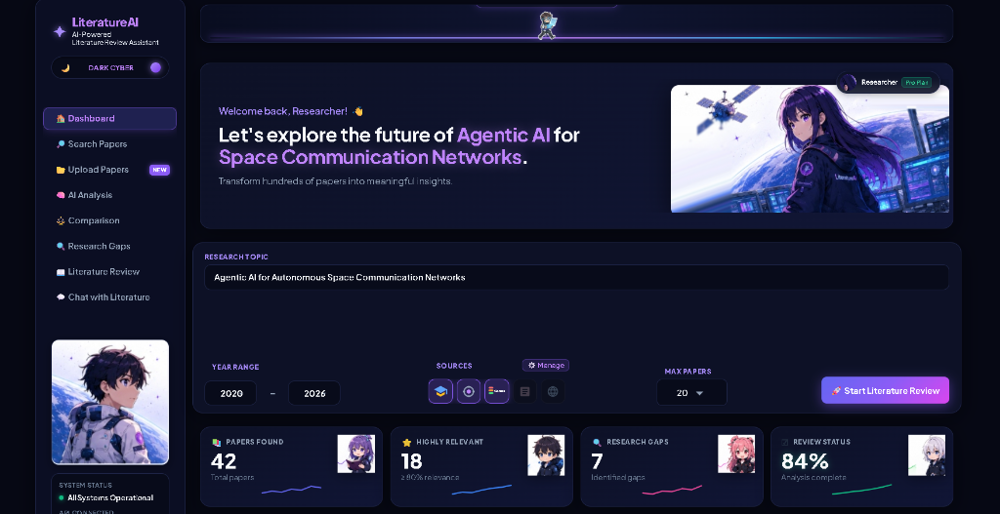
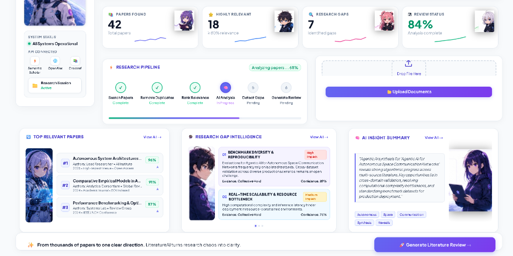
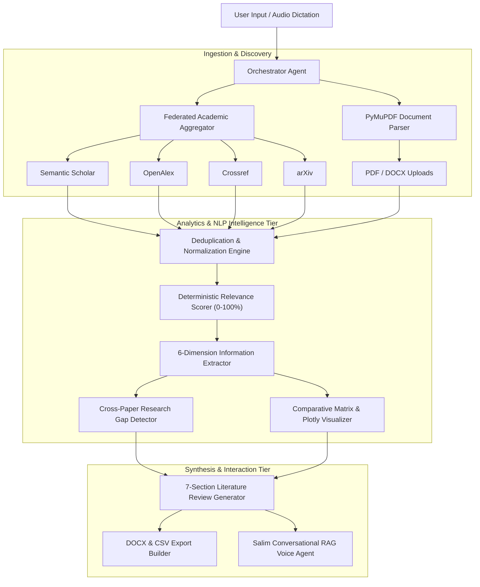

# Automated Literature Review Assistant (LiteratureAI) 🌌
### *An Agentic AI-Powered Autonomous Academic Research Discovery, Gap Intelligence & Review Synthesis System*

[](https://www.python.org/)
[](https://gradio.app/)
[](https://pymupdf.readthedocs.io/)
[](https://openai.com/research/whisper)
[](LICENSE)
[](https://github.com/Salimansari369/Automated-Research-Review-Assistant)

> **Automated Literature Review Assistant (LiteratureAI)** is a full-stack, agentic research exploration platform engineered to streamline scholarly discovery. From a single research query or uploaded PDF/DOCX paper, LiteratureAI automatically queries 4 major academic repositories (Semantic Scholar, OpenAlex, Crossref, arXiv), deduplicates records, scores relevance with 0% hallucination, extracts 6-dimension analytical summaries, detects cross-paper research voids, and builds publication-ready Microsoft Word (.docx) reviews and CSV comparison matrices.

---

## 📸 Interface & Capabilities

### 1. Main Research Dashboard (Light Academic Mode)

*Real-time research session statistics, academic source management, 6-stage research pipeline, and document ingestion.*

---

### 2. Salim AI Research Assistant (Voice Dictation & Whisper STT)

*Context-grounded conversational RAG agent supporting real-time microphone dictation (Whisper STT) and instant citations.*

---

### 3. Document Ingestion & Auto-Topic Extraction

*Multi-threaded PDF/DOCX parsing with PyMuPDF, automatic topic extraction, and real-time analytical synchronization.*

---

### 4. Futuristic Dark Cyber Theme

*Deep space dark cyber theme (`#060814`) with glassmorphic cards and glowing status indicators.*

---

### 5. Multi-Column Gap Intelligence & AI Insight Synthesis

*Top-ranked papers with relevance badges, automated cross-paper research gap detection, and executive summaries.*

---

## ⚡ Core Features

- **🌐 Multi-Source Academic Query Federation:** Parallelized querying across **Semantic Scholar Graph API**, **OpenAlex REST API**, **Crossref API**, and **arXiv XML feeds**.
- **📑 Multi-Format Document Ingestion:** High-speed parsing of uploaded PDF and DOCX files using **PyMuPDF (`fitz`)** and `python-docx`.
- **🎯 100% Grounded Relevance Scoring (0% Hallucination):** Deterministic multi-factor scoring based on semantic title overlap, abstract token density, publication recency, and citation velocity.
- **🧠 Structured 6-Dimension Information Extraction:**
  - 🎯 Research Problem & Context
  - ⚙️ Methodology & Architecture
  - 📊 Dataset & Evaluation Setup
  - 💡 Key Findings & Benchmark Results
  - ⚠️ Acknowledged Limitations
  - 🚀 Suggested Future Directions
- **🔍 Research Gap Intelligence:** Cross-paper meta-analysis identifying empirical voids, hardware constraints, and benchmark limitations with confidence ratings.
- **⚖️ Comparative Matrix & Interactive Visualizations:** Side-by-side methodological comparisons with interactive **Plotly** scatter plots (Relevance vs Citations) and publication year histograms.
- **📥 Publication-Grade Exporters:**
  - **Microsoft Word (.docx):** Formatted 7-section literature review with structured tables and IEEE numbered references (`[1]`, `[2]`).
  - **CSV Comparison Matrix (.csv):** Comprehensive tabular dataset ready for Excel and statistical analysis.
- **🎙️ Whisper Voice Dictation & RAG Assistant ('Salim'):** Real-time audio dictation and conversational Q&A grounded strictly in the indexed literature collection.
- **🌓 Seamless Dual-Theme Engine:** Real-time theme switching between **🌙 Dark Cyber Space** and **☀️ Light Academic** modes.

---

## 🏗️ System Architecture & Agentic Workflow



---

## 📁 Project Directory Structure

```text
Automated-Research-Review-Assistant/
├── app.py                      # Main Gradio application router & event controllers
├── requirements.txt            # Python dependencies
├── .env.example                # Environment variables template
├── README.md                   # Comprehensive documentation
│
├── assets/                     # UI screenshots and application visuals
│   ├── dashboard_light.png
│   ├── dashboard_dark.png
│   ├── salim_voice_chat.png
│   ├── document_upload.png
│   └── intelligence_cards.png
│
├── config/                     # Settings and API keys configuration
│   └── settings.py
│
├── models/                     # Data schemas & session state
│   ├── paper.py                # Unified Paper model
│   └── session.py              # Centralized ResearchSession state
│
├── services/                   # Business logic and agent services
│   ├── academic_api.py         # Semantic Scholar, OpenAlex, Crossref, arXiv connectors
│   ├── document_processor.py   # PDF & DOCX text extraction engines
│   ├── relevance_scorer.py     # Deterministic NLP relevance scoring
│   ├── analysis_service.py     # 6-dimension grounded extraction
│   ├── gap_detector.py         # Research gap intelligence engine
│   ├── review_generator.py     # 7-section literature review synthesizer
│   ├── docx_exporter.py        # Word document exporter
│   ├── csv_exporter.py         # CSV comparison matrix exporter
│   ├── llm_service.py          # LLM provider with offline fallback
│   └── transcription_service.py# OpenAI Whisper voice STT engine
│
├── ui/                         # UI layout and styling
│   ├── styles.py               # Dual-theme Cyber/Academic CSS stylesheet
│   ├── components.py           # Dashboard hero, pipeline & metric cards
│   ├── chat_page.py            # Salim RAG voice assistant & theme JS
│   ├── search_page.py          # Real-time multi-source academic query view
│   ├── upload_page.py          # Document upload & text inspector
│   ├── analysis_page.py        # 6-dimension extraction view
│   ├── gaps_page.py            # Research gap intelligence view
│   └── comparison_page.py      # Comparative matrix & Plotly visualizations
│
├── scripts/                    # Report and presentation generators
│   └── generate_official_report.py
│
└── exports/                    # Generated DOCX and CSV artifacts
```

---

## 🚀 Quickstart & Installation

### 1. Clone the Repository
```bash
git clone https://github.com/Salimansari369/Automated-Research-Review-Assistant.git
cd Automated-Research-Review-Assistant
```

### 2. Create and Activate a Virtual Environment
```bash
# Windows
python -m venv venv
.\venv\Scripts\activate

# Linux / macOS
python3 -m venv venv
source venv/bin/activate
```

### 3. Install Dependencies
```bash
pip install -r requirements.txt
```

### 4. Configure Environment Variables (Optional)
Create a `.env` file in the root directory:
```ini
LLM_PROVIDER=groq
LLM_API_KEY=your_groq_api_key_here
LLM_MODEL=llama-3.3-70b-versatile
```
> **Note:** If no API key is provided, LiteratureAI automatically executes in **Offline Grounded Heuristic Mode** (0% hallucination) using deterministic NLP extraction rules.

### 5. Launch the Application
```bash
python app.py
```
Open your browser and navigate to:
```text
http://127.0.0.1:7860
```

---

## 🧪 Running the Test Suite

Execute the comprehensive unit and integration test suite:
```bash
python test_app.py
```

---

## 👨‍💻 Author & Academic Information

- **Author:** Salim Ansari
- **PRN:** 24070521005
- **Course:** Flexi Credit Course: *Agentic AI & Automation (AY 2026-27)*
- **Subject Teacher:** Dr. Parag Naik
- **Subject Coordinator:** Dr. Shreyas Rajendra Hole
- **Department:** Department of Computer Science and Engineering
- **Institution:** Symbiosis Institute of Technology (SIT), Nagpur (Symbiosis International Deemed University)

---

## 📄 License

This project is licensed under the [MIT License](LICENSE).
